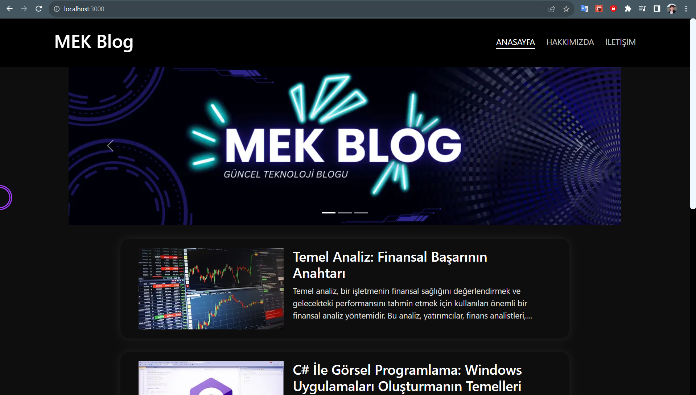
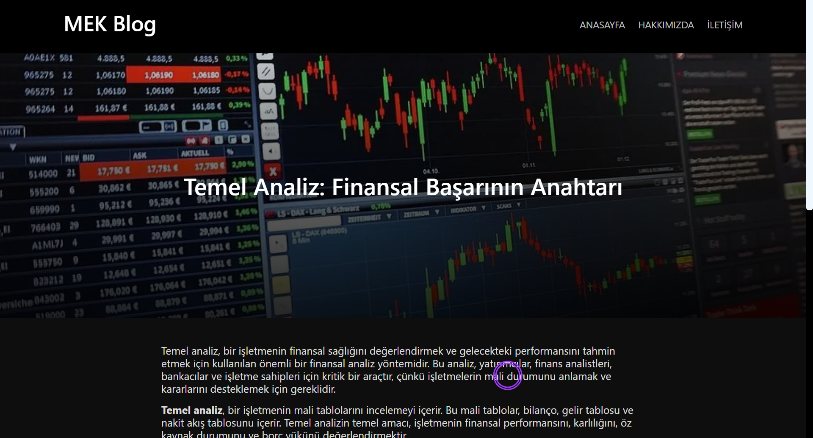
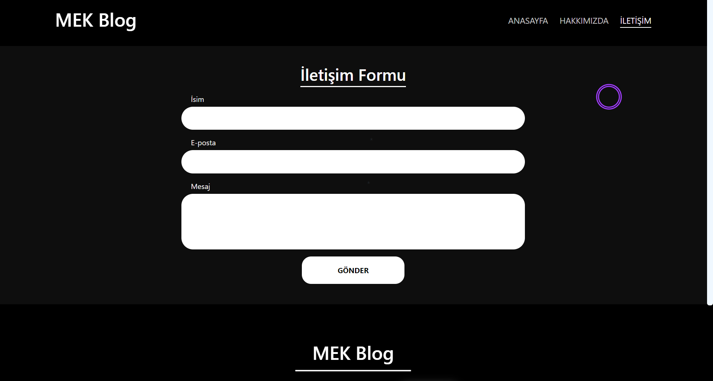
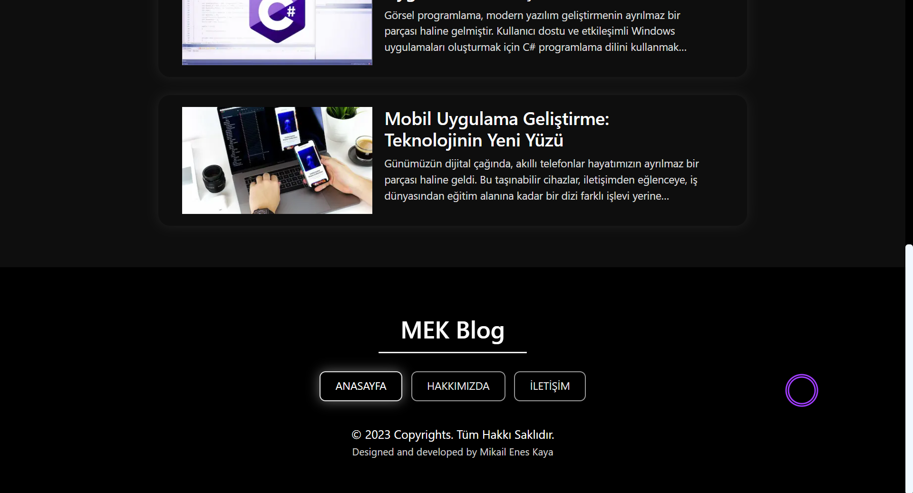
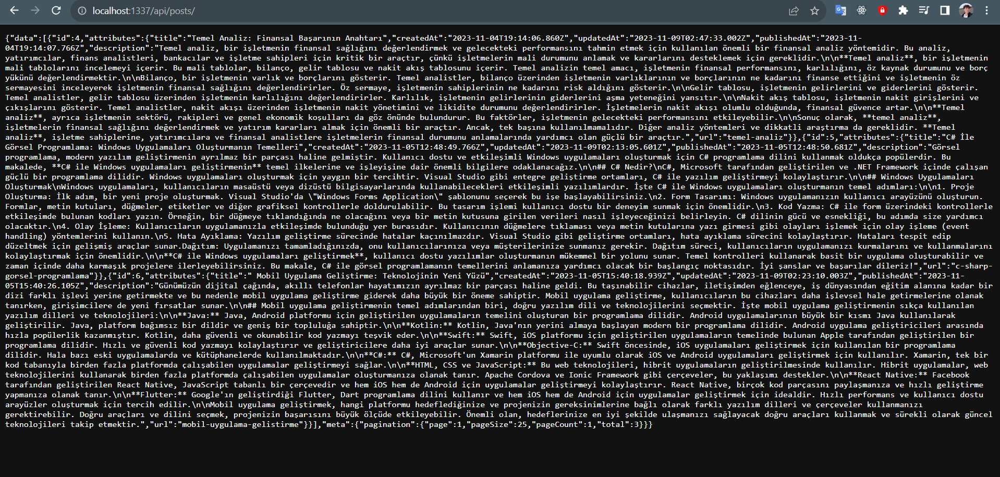

# MEK-Blog
My blog project I created using Next.js and Strapi.

### In this blog project that I developed as a project assignment; I used Next.js 13.5, Strapi, Marked and Bootstrap.

## Screenshots

